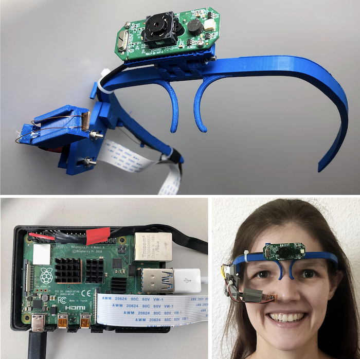
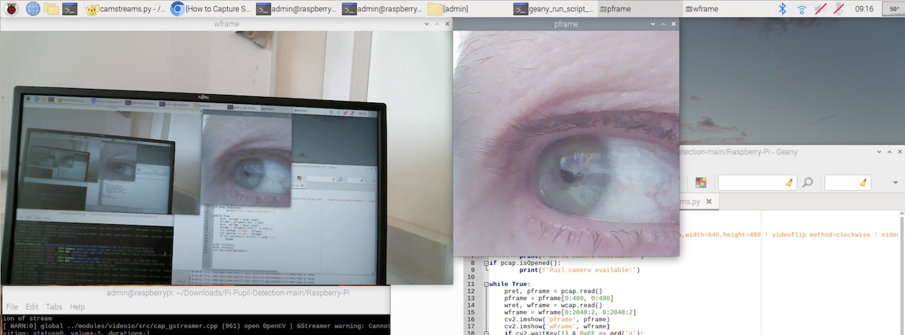

# Pi-Pupil-Detection
This repository contains code from the paper: 
Ankur Raj, Diwas Bhattarai, & Kristof Van Laerhoven (2023), "An Embedded and Real-Time Pupil Detection Pipeline". https://doi.org/10.5281/zenodo.7682640, https://arxiv.org/abs/2302.14098

And from my thesis: *Embedded Pupil Detection on a Raspberry Pi-based Wearable System* at the Ubiquitous Computing Lab at the University of Siegen, Germany.

## Step 1: Print your Eye-Tracker
We rely here on our open-source hardware .stl files by Diwas Bhattarai can be found in [Hardware](https://github.com/Lifestohack/masterthesis-eye-tracker/tree/master/models) and be 3D-printed. You can 3D print at 0.15 layer height. Use glue, ensure the print bed is hot, and use a brim of 4 mm to avoid warping (these work for use well on Cura and with an UltiMaker).
More detailed build instuctions are in the repository above. The designs use the Logitech c615 as a world camera and the MicroSoft HD 6000 or a Raspberry Pi camera as an (IR-lit) eye camera.



## Step 2: Use a Raspberry Pi as a local computing platform 
Since the development was done offline (on Windows) and on the Raspberry Pi, some code can be run as standalone software on benchmark datasets. 
To have the complete eye tracking experience with the [Eye-Tracker](https://github.com/Lifestohack/masterthesis-eye-tracker/tree/master/models), the eye tracking hardware has to be put together first (see above). We assume a [Raspberry Pi Model 4B](https://www.raspberrypi.com/products/raspberry-pi-4-model-b/) here with the default [Raspberry Pi OS Linux distribution](https://www.raspberrypi.com/documentation/computers/os.html) based on Debian, and an internet connection. There are a lot of other similar platforms though that probably work just as well.
### Project structure
```
Pi-Pupil-Detection
│   README.md
└───Configuration
│   │- Shell Script for project config in Pi
│
└───Raspberry-Pi
│    │- Scripts used for pupil detection on Pi   
│    
└─── Windows
│    │- Pupil detectors and Workbench for modifying parameters for detection  
....

```
## Step 3: Installing OpenCV and other packages on Pi
To install all packages need for our software on the Raspberry Pi, make the configuration-pi.sh script in the Configuration folder executable: 
```chmod a+x configuration-pi.sh```

..and then execute it with:
```sudo ./configuration-pi.sh```
## Step 4: Running the cameras and detector on Pi
Run this python script in the ```Raspberry-Pi``` folder to show both streams from the world and pupil cameras:
```python3 camstreams.py```

Two windows will pop up that give the live feed of both cameras. The result will look like this:



When running this python script in the same directory: ```python3 detect.py```, the detector will operate in real-time on the pupil camera and draw the detected pupil as an oval line: 


Look into the script to see which steps and parameters were used, these should work well for the above setup. For the experiment scripts that were used in the paper above, you can explore the Windows and Raspberry-Pi directories.


